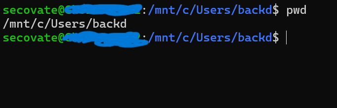
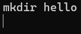
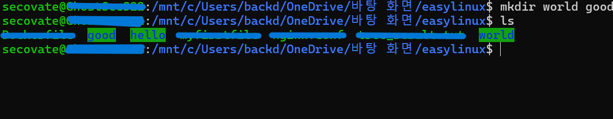
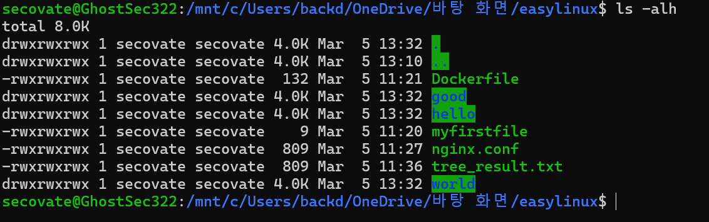
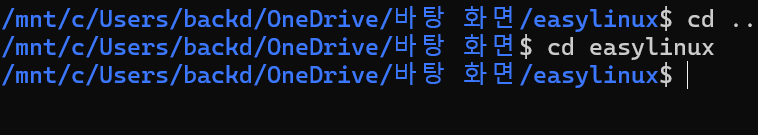

## 리눅스 명령어

### 1-1 현재위치 확인

- pwd를 사용하여 현재 위치를 파악할수 있다.
  

### 1-2 디렉토리 만들기

- mkdir [생성할 디렉토리 명]
  
  - 이런경우는 hello 라는디렉토리를 만들게 된다
    
  - 아래와 같이 여러개의 디렉토리를 만드는 것도 가능하다

### 1-3 리스트조회

- ls 를 이용한다.
  - 현재기준 디렉토리 조회: ls
  - 특정 디렉토리 조회: ls [디렉토리 위치]
  - 숨김파일 및 사이즈 함께조회 : ls -alh
    

### 1-4 디렉토리 이동

- cd[이동할 디렉토리명]
- 홈디렉토리: cd ~
- 상위디렉토리:cd ..
  

### 1-5 디렉토리,파일 복사

- cp명령어를 이용한다
  - 파일 복사: cp [원본 파일] [대상 위치]
  - 다른이름으로 복사: cp [원본 파일] [위치와 파일명]
  - 디렉토리 복사: cp -r [원본 위치] [대상 위치]
  - 현재 디렉토리로 복사: cp -r [원본 위치] .

### 1-6 디렉토리 ,파일 이동

- mv명령어를 이용한다.
  - 파일이동: mv [파일명][이동경로]
    - mv file1.txt /home/user/documents/
  - 디렉토리 이동
    - mv myfolder /home/user/documents/
  - 파일명 변경
    - mv oldname.txt newname.txt

### 1-7 디렉토리,파일 삭제

- rm명령어를 사용한다.

  - 파일 삭제
    - rm file.txt
  - 디렉토리 삭제
    - rm -r myfolder
  - 강제삭제
    - rm -rf 폴더명

### 1-8 파일/디렉터리 찾기

- find명령어를 이용한다.
  - find [찾을위치] -name [파일명/디렉터리명]

### 1-9 파일 내용확인,생성

- 파일을 생성할때 touch 를 사용한다.
  - touch [파일명]
- 파일의 내용확인을 할때에는 cat명령어를 사용한다.
  - cat [파일명]

### 1-10 파일 내용 검색

- grep를 사용한다. 하지만 이는 혼자서 사용되는 것이 아닌 다른 출력명령어랑 같이 사용된다
  - [출력명령어] | grep [검색어]
    - 파일의 내용 검색: cat [파일명] | grep [검색어]
    - 이전 n라인 출력: grep -B n [검색어]
    - 이후 n라인 출력: grep -A n [검색어]
    - 대소문자 구분 없이 검색: grep -i [검색어]

## VIM

- 파일 작성,수정할때 사용한다.
  - INSERT 모드(i):문자를 편집
  - COMMAND모드(esc):복사/붙여넣기,
    파일 저장/종료 등 다양한 작업을 할 수 있다
    - 종료(quit) :q 입력 후 enter
    - 저장(write) 및 종료:wq 입력 후 enter
    - 저장 및 강제종료(!) :wq! 입력 후 enter
    - 줄삭제(delete) dd
    - 복사(copy) yy
    - 붙여넣기(paste) p
    - 되돌리기(undo) u

## Reditection

- 출력 결과를 저장한다.
  - [이전 명령어] > 파일명
    - '>' : 기존 파일이 있을경우 덮어쓰기
    - '> >' : 기존 파일이 있을경우 내용추가

## Symbolic Link

- 링크를 연결하여 원본 파일을 직접 사용하는 것과 같은 효과를 내는 링크다.
  - 심볼릭 링크 설정
    - ln -s [대상 원본 파일] [새로 만들 파일 이름]
  - 심볼릭 링크 해제
    - rm [링크 파일]
