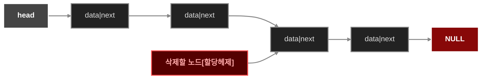

## 연결리스트
### 배열기반 리스트
- 데이터를 순차적으로 저장하고 처리할 떄에는 배열기반 리스트를 간단히 이용할수 있습니다.

|1|5|4|7|8|9|12|15|

```c
#include<stdio.h>
int arr[10000];
int count =0;
void addback(int data){
    arr[count]=data;
    count ++;
}
void addfront(int data){
    for (int i= count;  i>=1;i--){
        arr[i]=arr[i-1];
    }
    arr[0]=data;
    count ++;
}
void addat(int index,int data){
    for (int i= count;  i>=index-1;i--){
        arr[i]=arr[i-1];
    }
    arr[index-1]=data;
    count++;
}
void removeat(int index){
    for(int i=index; i<=count; i++){
        arr[i-1]=arr[i];
    }
    count --;
}
void show(){
    for(int i=0; i< count; i++){
        printf("%d ",arr[i]);
    }
}
int main(void){
    addfront(4);
    addfront(5);
    addback(7);
    addat(1,10);
    addat(2,90);
    show();
    removeat(2);
    printf("\n");
    show();
    return 0;
}
```

- 배열로 만들었으므로 특정한 위치의 원소에 즉시 접근 가능하다는 장점이 있습니다.
- 데이터가 들어갈 공간에 미리 메모리를 할당해야 한다는 단점이 있습니다.
- 원하는 위치로의 삽입,삭제가 비효율적입니다. 

## 단일 연결리스트 
- 일반적으로 연결리스트(Linked List)는 구조체와 포인터를 함께 사용해서 구현합니다.
- 연결리스트는 리스트 중간지점에 노드를 추가하거나 삭제할수 있어야 합니다.
- 필요할때마다 공간을 할당받습니다.

- 단일 연결리스트는 다음과 같은 형태로 나타낼수 있습니다.
- 포인터를 이용하여 단방향적으로 다음 노드를 가리킵니다.
- 일반적으로 연결리스트의 시작노드를 Head라고 하며 별도로 관리합니다.
- 다음노드가 없는 끝노드는 다음 위치의 값으로 NULL을 값으로 가집니다.

    ```mermaid
   graph LR;
    classDef nodeStyle fill:#222,stroke:#888,stroke-width:2px,color:#ddd;
    classDef headStyle fill:#444,stroke:#fff,stroke-width:2px,font-weight:bold,color:#fff;
    classDef nullStyle fill:#880808,stroke:#fff,stroke-width:2px,font-weight:bold,color:#fff;

    Head[" head "]:::headStyle --> A
    A["data|next"]:::nodeStyle --> B["data|next"]:::nodeStyle 
    B --> C["data|next"]:::nodeStyle
    C --> D["data|next"]:::nodeStyle
    D --> E["data|next"]:::nodeStyle
    E --> F["NULL"]:::nullStyle

    linkStyle default stroke:#888,stroke-width:2px;

    ```
### 연결리스트 구조체 만들기

```c
typedef struct{
    int data;
    struct Node *next;
}Node;
```
### 삽입과정
- 아래와 같이 존재하는 연결리스트에서 새로운 노드를 3이 들어있는 노드와 4가 들어있는 노드 사이에 삽입하는 과정은 아래와 같습니다

    ```mermaid
graph LR;
    classDef nodeStyle fill:#222,stroke:#888,stroke-width:2px,color:#ddd;
    classDef headStyle fill:#444,stroke:#fff,stroke-width:2px,font-weight:bold,color:#fff;
    classDef nullStyle fill:#880808,stroke:#fff,stroke-width:2px,font-weight:bold,color:#fff;
    classDef newStyle fill:#004455,stroke:#00ccff,stroke-width:2px,font-weight:bold,color:#aaddff;

    Head[" head "]:::headStyle --> A
    A["1|next"]:::nodeStyle --> B["2|next"]:::nodeStyle 
    B --> C["3|next"]:::nodeStyle
    C --> D["4|next"]:::nodeStyle
    D --> E["5|next"]:::nodeStyle
    E --> F["NULL"]:::nullStyle

    G["New|next"]:::newStyle

    linkStyle default stroke:#888,stroke-width:2px;

    ```

    1. 우선 새로 추가할 노드의 next에 4가 들어있는 노드의 주소를 지정합니다.


    ```mermaid
   graph LR;
    classDef nodeStyle fill:#222,stroke:#888,stroke-width:2px,color:#ddd;
    classDef headStyle fill:#444,stroke:#fff,stroke-width:2px,font-weight:bold,color:#fff;
    classDef nullStyle fill:#880808,stroke:#fff,stroke-width:2px,font-weight:bold,color:#fff;
    classDef newStyle fill:#004455,stroke:#00ccff,stroke-width:2px,font-weight:bold,color:#aaddff;

    Head[" head "]:::headStyle --> A
    A["1|next"]:::nodeStyle --> B["2|next"]:::nodeStyle 
    B --> C["3|next"]:::nodeStyle
    C --> D["4|next"]:::nodeStyle
    D --> E["5|next"]:::nodeStyle
    E --> F["NULL"]:::nullStyle

    G["New|next"]:::newStyle --> D

    linkStyle default stroke:#888,stroke-width:2px;

    ```

    2. 그후 3이 들어있는 노드의Next를 새로운 노드의 주소로 값을 변경합니다. 

    ```mermaid
 graph LR;
    classDef nodeStyle fill:#222,stroke:#888,stroke-width:2px,color:#ddd;
    classDef headStyle fill:#444,stroke:#fff,stroke-width:2px,font-weight:bold,color:#fff;
    classDef nullStyle fill:#880808,stroke:#fff,stroke-width:2px,font-weight:bold,color:#fff;
    classDef newStyle fill:#004455,stroke:#00ccff,stroke-width:2px,font-weight:bold,color:#aaddff;

    Head[" head "]:::headStyle --> A
    A["1|next"]:::nodeStyle --> B["2|next"]:::nodeStyle 
    B --> C["3|next"]:::nodeStyle

    D --> E["5|next"]:::nodeStyle
    E --> F["NULL"]:::nullStyle

    C --> G
    G["New|next"]:::newStyle --> D["4|next"]:::nodeStyle

    linkStyle default stroke:#888,stroke-width:2px;

    ```

이것을 코드로 구현해보겠습니다. 

```c

void add(Node *root,int data){
    Node *node=(Node *) malloc(sizeof(Node));
    node->data= data;
    node->next= root->next;
    root->next=node;
}

```

- 위와 같이 구현을 하여 node에 data를 저장합니다.
- 새로 추가된 노드는 다음 node를 지정하며 그 앞의 node는 새로 추가된 node를 다음으로 지정합니다.

### 삭제과정 


- 위와같은 연결리스트에서 삭제를 진행하는 과정은 아래와 같습니다.



- 삭제할 노드 앞 노드에서 next를 삭제할 노드 다음노드의 주소를 지정합니다.


- 동적할당 헤제를 함으로 특정 노드를 삭제할수 있습니다. 
- 아래는 삭제과정을 코드로 작성한것입니다.

```c
void removeNode(Node *root){
    Node *front= root->next;
    root->next=front->next;
    free(front);
}
```

- `Linked List`는 맨 마지막 노드의 next 주소로 `NULL`을 가집니다. 이것을 이용하여 전체 노드를 헤제를 하거나 전체노드를 출력할수 있습니다.

```c
void freeall(Node *root){
    Node *cur= root->next;
    while(cur !=NULL){
        Node *next= cur->next;
        free(cur);
        cur= next;
    }
}
void showall(Node *root){
    Node *cur =root->next;
    while(cur != NULL){
        Node *next= cur->next;
        printf("%d -> ",cur->data);
        cur=next;

    }
    printf("NULL");
}

```
