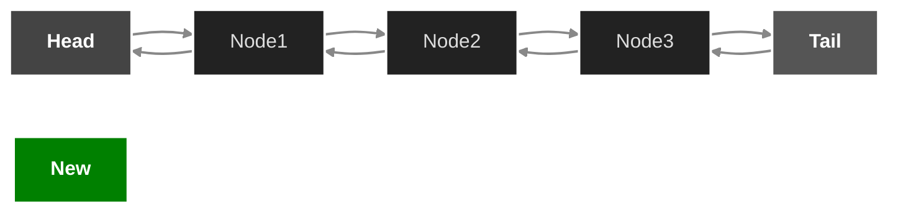
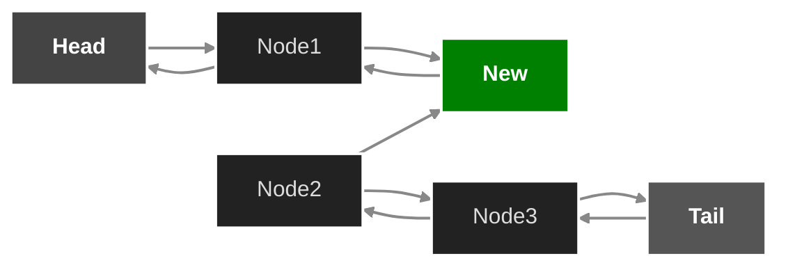
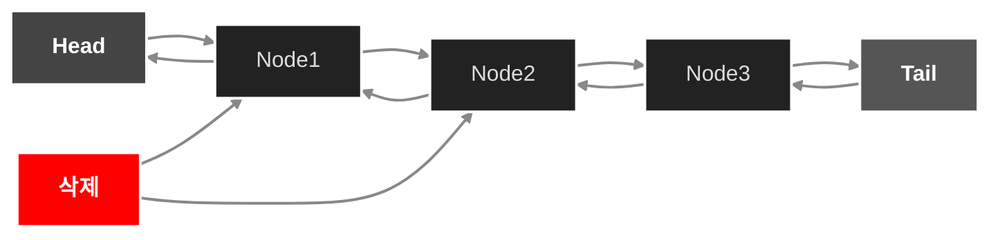

## 1. 양방향 연결리스트
- 양방향 연결리스트는 머리(head)와 꼬리(Tail)를 모두 가진다는 특징이 있습니다
- 양방향연결리스트의 각 노드는 앞 노드와 뒤 노드의 정보를 모두 저장하고 있습니다.
- 해당 포스트에서는 데이터를 `오름차순`으로 저장하는 양방향 연결리스트를 구현해보겠습니다.


## 노드선언
- 해당 포스트에서는 정수형 데이터만 저장한다고 가정하겠습니다. 
- 양방향으로 연결하기 위해 앞노드의 주소와 뒤 노드의 주소가 필요합니다. 
- 따라서 구조체를 이용하여 아래와 같이 선언해야 합니다

```c
typedef struct 
{
    int data;
    Node *prev;
    Node *next;
    
}Node;

```
## 삽입과정

-Node 1 다음위치에 새로운 노드를 삽입을 해보겠습니다. 


- 우선 Node1이 가리키는 다음노드를 새로운 노드로 향하게 합니다.
- 새로운 노드는 앞노드로 Node1을 지정합니다.



- 그리고 Node2의 앞노드를 새로운 노드로 향하게 합니다.
- 새로운 노드의 다음노드로 Node2를 향하게 합니다.


- 이러한 과정으로 노드를 추가할수 있습니다.

## 삭제과정

- 삭제과정은 아래와 같습니다.


- 우선 삭제할 노드의 앞 노드의 next로 삭제할 노드의 next노드로 지정합니다.
- 그 다음으로 삭제할 노드 의 뒷 노드에서 prev를 삭제할 노드 앞 노드로 지정합니다.



- 마지막으로 삭제할 노드를 할당헤제 함으로 삭제기능을 구현할수 있습니다.


- 이 과정을 소스코드로 구현하면 아래와 같습니다.

```c
void remove_node(Node*root){
    Node *node =root->next;
    root->next= node->next;
    Node *next = node->next;
    next->prev=root;
    free(node);

}
```

- 전체 출력하는 함수는 아래와 같습니다.

```c
void show(){
    Node *cur=head->next;
    while(cur!=tail){
        printf("%d ",cur->data);
        cur=cur->next;
    }
}
```

- 전체코드 입니다.

```c
#include<stdio.h>
#include<stdlib.h>
typedef struct Node
{
    int data;
    struct Node *prev;
    struct Node *next;
    
}Node;
Node *head, *tail; //head와 Tail을 선언한다.

//삽입함수
void insert(Node* root,int data){
    Node *node = (Node*)malloc(sizeof(Node));
    node->data = data;
    
    Node* cur = root->next;
    root->next = node;
    node->prev = root;
    node->next = cur;


}

void remove_node(Node*root){
    Node *node =root->next;
    root->next= node->next;
    Node *next = node->next;
    next->prev=root;
    free(node);

}
void show(){
    Node *cur=head->next;
    while(cur!=tail){
        printf("%d ",cur->data);
        cur=cur->next;
    }
}
int main(void){
    head = (Node*)malloc(sizeof(Node));
    tail = (Node*)malloc(sizeof(Node));
    head->next=tail;
    head->prev=head;
    tail->next=tail;
    tail->prev=head;
    insert(head,2);
    insert(head,3);
    insert(head,4);
    insert(head,5);
    show();
    printf("\n");
    remove_node(head->next);
    show();
    return 0;
}

```