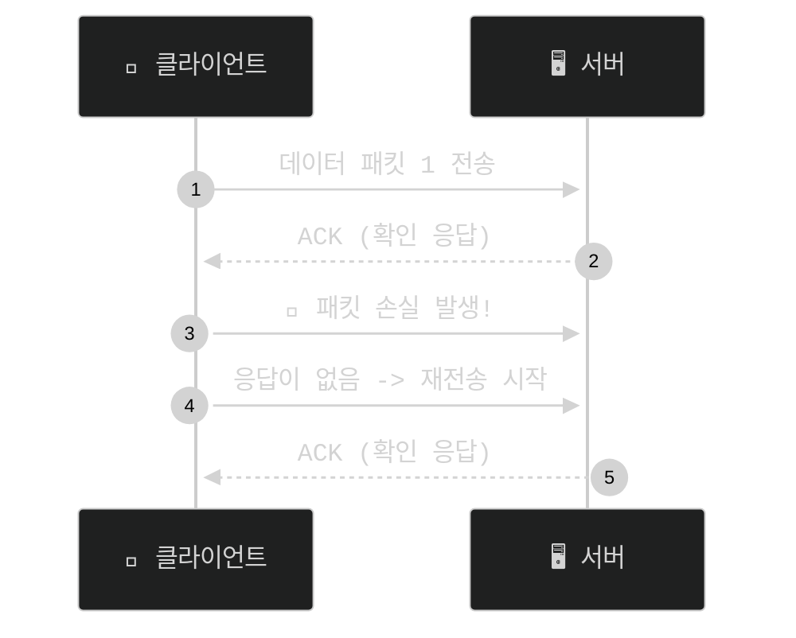
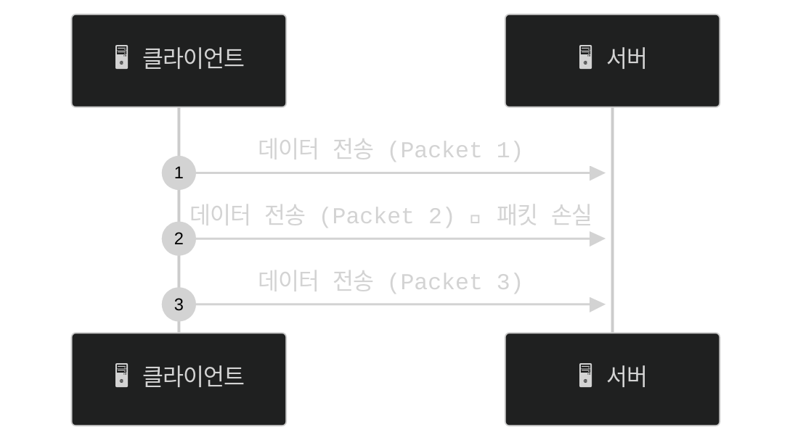
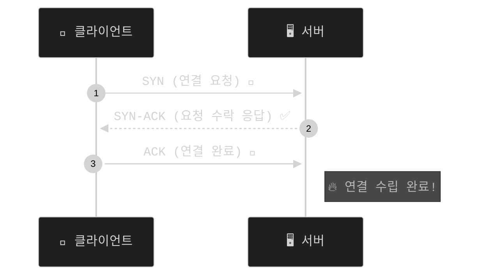
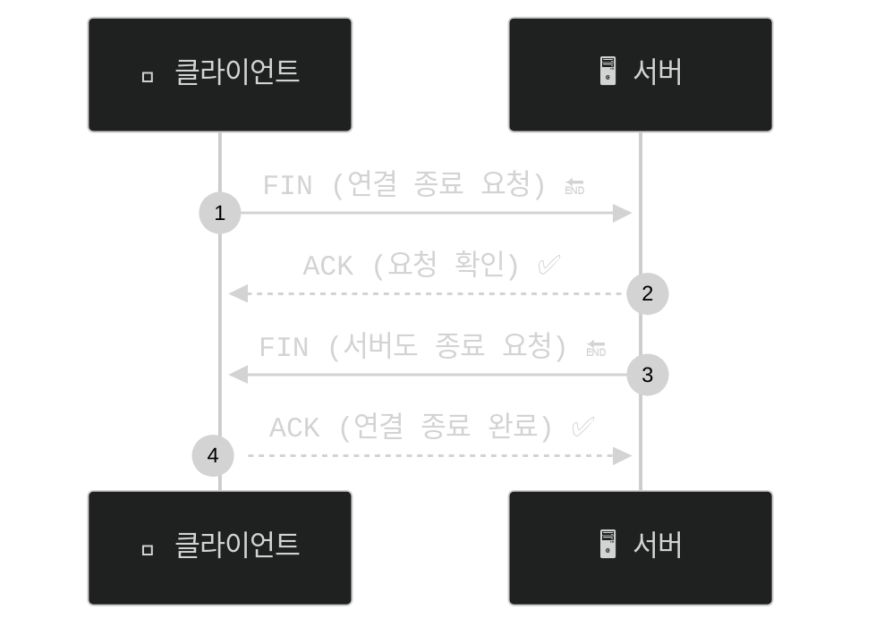
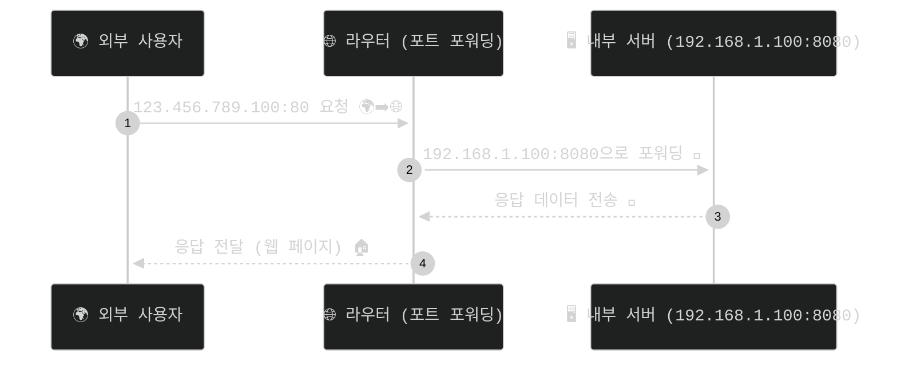

- 프로토콜은 컴퓨터나 네트워크 장비들이 서로 통신하기 위한 약속된 규칙입니다. 
- 마치 우리가 대화할 때 사용하는 언어와 같은 개념입니다

## 1. OSI 7계층과 프로토콜

**OSI 7 Layer**는 네트워크 통신 과정을 7단계로 나눈 모델이며, 각 계층은 서로 독립적으로 동작하면서도 유기적으로 연결되어 있음.

| 계층 | 역할 | 
|------|----------------|
| **응용 계층** | 사용자와 직접 상호작용 |
| **표현 계층** | 데이터 인코딩, 암호화 | 
| **세션 계층** | 세션 설정 및 유지 |
| **전송 계층** | 데이터의 신뢰성 보장 |
| **네트워크 계층** | IP 주소를 통한 라우팅 |
| **데이터 링크 계층** | MAC 주소 기반 통신 | 
| **물리 계층** | 물리적 신호 전송 |

---

### 1계층 - 물리계층

- 장치와 통신 매체 사이의 비정형 데이터의 전송을 담당합니다.
    - 디지털 bit(0,1)를 전기,무선 또는 광 신호로 변환합니다.
- 전송방법 제어신호 기계적 속성을 정의

### 2계층 - 데이터링크

- 동일 네트워크 내에서 데이터 전송
- 링크를 통해 연결설정하고 관리
- 물리계층에서 발생할수 있는 오류감지 수정

### 3계층 -네트워크

- 다른 네트워크로 데이터를 전송합니다
- IP주소를 이용하여 통신을 합니다.
- 출발지 IP에서 목적지 IP로 데이터 통신시 중간에서 라우팅 처리를 합니다.
- 데이터가 큰 경우 패킷단위로 분활및 전송후 목적지에서 조립하여 메시지를 구현합니다.

### 4계층 - 전송계층

- 호스트간 데이터를 전송
- 오류복구, 흐름제어, 완벽한 전송을 보장합니다.
    - `ex) TCP/UDP`

### 5계층 - 세션

- 로컬 및 애플리케이션간 IP/Port연결을 관리합니다.

### 6계층 - 표현

- 사용자 프로그램(Client)와 네트워크 형식간 데이터를 변환하여 표현과 독립성을 제공합니다.
- 인코딩, 디코딩,암호화,압축등이 있습니다.

### 7계층 - 응용계층

- 사용자와 가장 밀접한 소프트웨어

##  2. TCP와 UDP
- TCP와 UDP는 전송 계층에 해당하는 프로토콜로, 송신자와 수신자를 연결하는 통신을 제공합니다.

### TCP
- 연결형 프로토콜 입니다( 3-Way Handshake/ 4-Way Handshake  필요)
- 데이터의 신뢰성과 순서를 보장합니다.
- 흐름 제어 및 혼잡 제어를 포함합니다.
- 전이중, 점대점 방식입니다.



### UDP
- 비연결형 프로토콜 입니다.(Handshake 과정 없음)
- 속도가 빠르지만 신뢰성이 낮습니다.



---

## 3. TCP, IP연계

- tcp와 ip는 인터넷에서 데이터를 전송하는데 사용되는 주요 프로토콜 입니다.
- 서로 다른 역할을 수행하지만 함께 동작하여 안정적으로 데이터를 전송합니다.

### TCP 주요 역할
- 데이터를 작은 단위(세그먼트) 로 나누어 전송
- 데이터가 손실되거나 순서가 어긋나면 재전송 요청 및 순서 정렬
- 수신 측에서 정상적으로 데이터를 받았는지 확인(ACK 응답)
- 흐름 제어(Flow Control) 및 혼잡 제어(Congestion Control) 기능 제공

### IP 주요역할
- IP는 데이터를 목적지까지 전달하는 역할을 수행하는 프로토콜입니다.

- 데이터를 패킷(Packet) 단위로 분할하여 전송

- 목적지 IP 주소를 기반으로 최적 경로(Route) 설정

- 중간 라우터를 통해 패킷을 전달

- 패킷이 손실되거나 순서가 어긋나도 복구하지 않음

### TCP/IP모델
- TCP , IP 이 둘을 아용하여 `TCP/IP`모델이 등장하였습니다.

| TCP/IP 계층 | 역할 | 주요 프로토콜 |
|------------|--------------------------------|--------------------------|
| 응용 계층 (Application) | 사용자와 네트워크 간 데이터 처리 | HTTP, HTTPS, FTP, SMTP, DNS |
| 전송 계층 (Transport) | 신뢰성 있는 데이터 전송 및 흐름 제어 | **TCP, UDP** |
| 인터넷 계층 (Internet) | 패킷을 목적지까지 라우팅 및 전달 | **IP, ICMP, ARP** |
| 네트워크 인터페이스 계층 (Network Interface) | 실제 네트워크를 통해 데이터 전송 | 이더넷, Wi-Fi, PPP |

---

## 4. 3-Way Handshake (TCP 연결 과정)

### **과정**
1. 클라이언트 → 서버: **SYN 전송 (연결 요청)**  
2. 서버 → 클라이언트: **SYN-ACK 전송 (요청 수락 응답)**  
3. 클라이언트 → 서버: **ACK 전송 (연결 완료)**  
- 연결이 완료된 후, 데이터 전송이 시작됩니다.



---

## 5. 4-Way Handshake (TCP 연결 종료 과정)

### **🔹 과정**
1️⃣ 클라이언트 → 서버: **FIN 전송 (연결 종료 요청)**  
2️⃣ 서버 → 클라이언트: **ACK 전송 (요청 확인)**  
3️⃣ 서버 → 클라이언트: **FIN 전송 (서버도 종료 요청)**  
4️⃣ 클라이언트 → 서버: **ACK 전송 (연결 종료 완료)**  

➡️ TCP 연결이 정상적으로 종료됨.


---

## 6. IPv4와 IPv6

### **🔹 IPv4**
- **32비트 주소 체계 (예: 192.168.1.1)**
- 약 **43억 개**의 IP 주소 할당 가능
- 주소 부족 문제로 인해 IPv6가 도입됨

### **🔹 IPv6**
- **128비트 주소 체계 (예: 2001:db8::1)**
- 이론적으로 **무제한 IP 주소 제공**
- 보안 기능이 향상되고 자동 주소 설정 기능 제공

---

## 7. DNS (Domain Name System)

- **도메인 이름을 IP 주소로 변환해주는 시스템**
- 예: `www.google.com` → `142.250.74.14`
- DNS 요청 과정:
  1. 사용자가 브라우저에서 `www.example.com` 입력
  2. DNS 서버가 해당 도메인의 IP 주소를 조회
  3. 웹 브라우저가 해당 IP 주소로 접속

  ```mermaid
 %%{init: {'theme': 'dark', 'themeVariables': { 'primaryColor': '#ff4444', 'fontFamily': 'monospace', 'fontSize': '16px', 'textColor': '#ffffff'}}}%%
sequenceDiagram
    autonumber
    participant User as 👤 사용자 
    participant DNS as 📡 DNS 서버
    participant Server as 🖥️ 웹 서버

    User->>+DNS: www.example.com의 IP 주소 조회 ❓
    DNS-->>+User: IP 주소 응답 (192.168.1.1) 📩
    User->>+Server: 해당 IP로 접속 요청 🚀
    Server-->>+User: 웹 페이지 응답 (HTML, CSS, JS) 🏠
    User-->>User: 웹 페이지 렌더링 완료 🎉


  ```

➡️ DNS가 없으면 모든 웹사이트를 IP 주소로 입력해야 함.

---

## 8. 포트 (Port)

- **네트워크에서 특정 서비스를 식별하는 번호**
- 하나의 IP 주소에서 여러 서비스가 동작할 수 있도록 함.

| 포트 범위 | 설명 | 예시 |
|-----------|--------------------|----------------|
| 0~1023 | Well-Known 포트 | HTTP(80), HTTPS(443), FTP(21), SSH(22) |
| 1024~49151 | 등록된 포트 | MySQL(3306), RDP(3389) |
| 49152~65535 | 동적 포트 | 임시 할당 |

---

## 9. 포트 포워딩 (Port Forwarding)

- **내부 네트워크에서 특정 포트를 외부에서 접근할 수 있도록 설정**
- 주로 **원격 접속, 웹 서버 운영, 게임 서버 개설** 등에 사용됨.

### **🔹 예시**
- `192.168.1.100:8080` → `123.456.789.100:80`로 포워딩하면, 외부 사용자가 `123.456.789.100:80`을 입력하면 내부 서버의 8080 포트로 연결됨.



---

