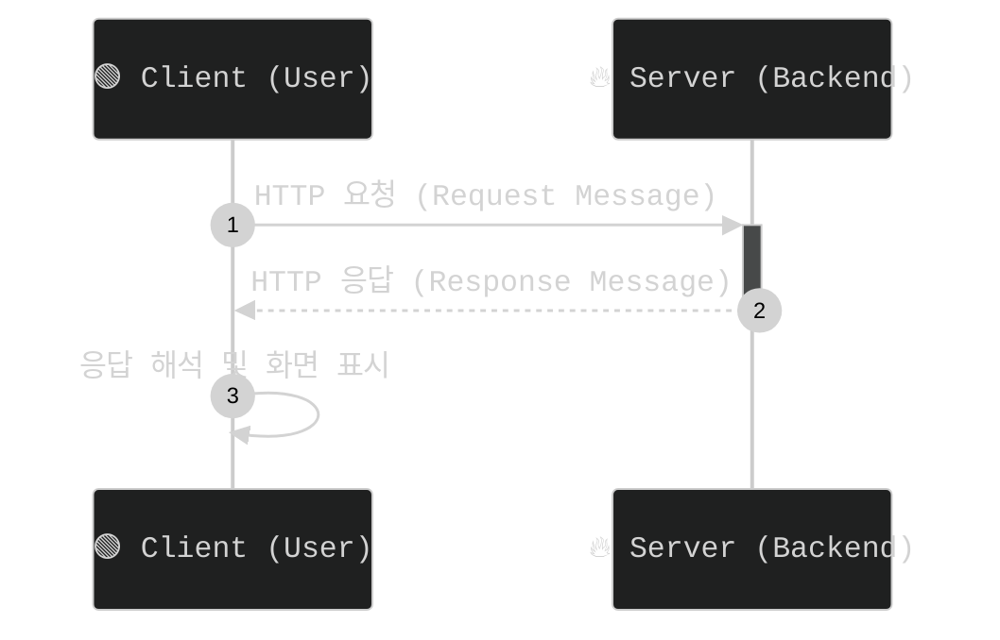

## 웹이란?
Web는 **World Wide Web (WWW)**의 줄임말로 , 인터넷을 통해 정보를 공유하고 접근할수 있는 서비스 이자 시스템입니다. 

- 하이퍼텍스트(Hypertext) 방식으로 정보를 연결
- 웹 페이지는 HTML, CSS, JavaScript 등으로 구성
- HTTP/HTTPS 프로토콜을 통해 웹 서버와 통신

## 웹과 인터넷

|구분|웹|인터넷|
|-|---|----|	
|정의|인터넷 위에서 동작하는 정보 공유 시스템|전 세계 네트워크의 연결|	
|프로토콜|HTTP, HTTPS | TCP/IP, UDP, FTP | 
|기능|웹사이트 탐색, 검색, 웹 애플리케이션|메일 서비스(Gmail), 파일 공유|

- 인터넷은 물리적인 네트워크이고 웹은 그 위에서 동작하는 서비스 입니다.

## 웹서버

- 웹 서버는 **웹 페이지를 제공하는 서버** 입니다.
- 사용자의 요청을 받아 웹 페이지를 반환합니다.

### 웹서버 동작원리

- 사용자가 웹 브라우저에 URL을 입력합니다.
- HTTP Request Message 를 웹서버에 전송합니다.
- 웹 서버는 요청을 분석하고 해당하는 웹 페이지를 찾아서 HTTP Response Message를 반환합니다.
- 웹 브라우저가 받은 Message를 해석하여 화면에 표시합니다.

## 웹 브라우저

- 웹 브라우저는 사용자가 웹 페이지를 열람할수 있도록 도와주는 프로그램입니다.

### 역할

- 웹 서버에 요청을 보내고 응답을 받아 웹 페이지를 렌더링합니다.
- HTML, CSS, JavaScript를 해석하여 화면에 표시합니다.

## 서버와 클라이언트

### 서버
- Client 요청을 받아 처리하고 응답을 보내는 역할을 합니다
### 클라이언트
- 서버에게 요청을 보내고 응답을 받아 사용자에게 제공하는 역할을 합니다. 
- 웹 브라우저가 대표적인 예시 입니다.

### Server-Client 모델 구조

1. **클라이언트(Client)** → 서버(Server)로 **HTTP 요청(Request Message)**을 보냄  
2. **서버(Server)** → 요청을 **처리**한 후, 결과를 담은 **HTTP 응답(Response Message)**을 클라이언트로 전송  
3. **클라이언트(Client)** → 받은 **응답(Response Message)**을 해석하여 화면에 표시  

