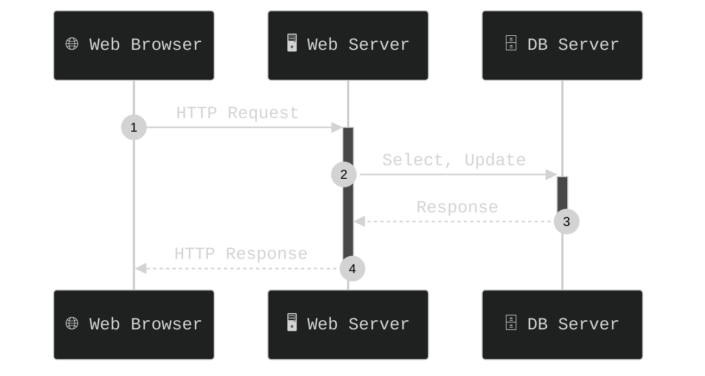
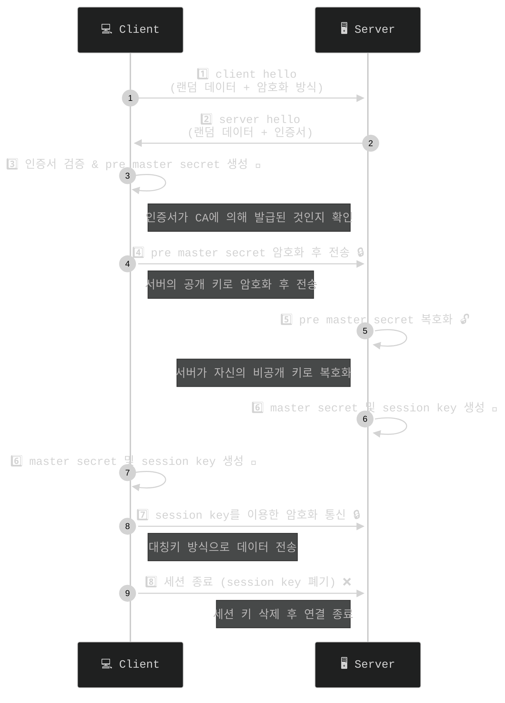

## 1. HTTP란?

- HTTP(HyperText Transfer Protocol)은 Web 상에서 client 와 server간에 텍스트 이미지 영상등 데이터를 주고받기 위한 통신규약(프로토콜)입니다.



## 2. HTTP와 HTTPS

- HTTP는 데이터를 전송하는 통신규약입니다. 하지만 따로 암호화 작업이 없어서 데이터를 중간에 가로채면 그대로 노출이 됩니다. [ 보안상 취약할수 있습니다.]

- HTTPS는HTTP에서 SSL/TLS 암호화 작업이 추가된 것입니다.
- 이를 통하여 보안성이 높아졌습니다.

|항목|HTTP|HTTPS|
|----|---|-----|
|보안| 없음| SSL/TLS사용|
| 포트|80|443|
|암호화| X|O
|인증서사용| X |O|


## 3. HTTP헤더,바디구조

- 해당 부분은 HTTP 구조입니다. 

```text 

---------------------------------------------------------
POST /login HTTP/1.1
Host: www.example.com
User-Agent: Mozilla/5.0 (Windows NT 10.0; Win64; x64)      해당 부분은 헤더 부분입니다.
Content-Type: application/x-www-form-urlencoded
Content-Length: 29
Connection: keep-alive
------------------------------------------------------------

username=ghost&password=sec123         해당부부은 바디 부분입니다.

  ```
### 헤더

- 헤더 부분에는 Method와 요청 URL이 명시 되어 있습니다 `POST /login HTTP/1.1`
- 서버 도메인 을 명시합니다. `Host: www.example.com`
- 클라이언트의 정보를 명시합니다 `User-Agent: Mozilla/5.0 (Windows NT 10.0; Win64; x64) `
- 요청 바디 타입을 나타냅니다. `Content-Type`
- 버다애 포함된 데이터의 총 길이를 나타냅니다.(바이트 단위) `Content-Length: 29`
- Keep-alive이면 요청 후에도 TCP연결을 유지하겠다는 의미 입니다. `Connection`

### 바디

- 해당 부분에는 서버에 보내는 정보가 저장됩니다. 
- URL인코딩 작업을 합니다. 

## 4. HTTP method
- HTTP로 데이터를 보내는 방식을 명시합니다.

| Method  | 설명                        |
|---------|-----------------------------|
| GET     | 데이터 조회 (URL 파라미터로 전송) |
| POST    | 데이터 생성 (Body에 데이터 포함) |
| PUT     | 전체 수정                    |
| PATCH   | 부분 수정                    |
| DELETE  | 데이터 삭제                  |


## 5. HTTP 상태코드
- HTTP 요청에 따라 서버는 응답을 하게 됩니다.
- 하지만 클라이언트가 잘못된 요청을 보내거나 서버의 오류로 인한 문제가 있을경우 가 있을수 입니다.
- HTTP는 상태코드를 제공하며 이를 통하여 상태에 따라 오류를 출력합니다.

| 코드  | 의미                                         |
|-------|----------------------------------------------|
| 1xx   | 정보 (처리 중)                               |
| 2xx   | 성공 (200 OK, 201 Created 등)               |
| 3xx   | 리다이렉션 (301 Moved Permanently, 302 Found 등) |
| 4xx   | 클라이언트 오류 (400 Bad Request, 401 Unauthorized, 404 Not Found 등) |
| 5xx   | 서버 오류 (500 Internal Server Error, 502 Bad Gateway 등) |

## 6. SSL인증서

- **SSL(Secure Sockets Layer)**은 인터넷을 통해 데이터를 안전하게 전송하기 위한 보안 프로토콜입니다. 웹사이트와 사용자 간의 통신을 암호화하여 민감한 정보를 보호하는 데 중요한 역할을 합니다.
- SSL 인증서는 웹사이트 소유자가 자신의 신원을 증명하고, 클라이언트와 서버 간의 데이터를 암호화하기 위해 사용하는 디지털 인증서입니다. 이를 통해 온라인 상에서 개인정보와 결제 정보와 같은 민감한 데이터를 안전하게 보호할 수 있습니다.

- **주요기능**
    - **데이터 암호화**:SSL 인증서는 클라이언트와 서버 간의 데이터를 암호화하여, 중간에서 누군가가 도청하더라도 내용을 해독할 수 없도록 만듭니다. 예를 들어, 온라인 쇼핑몰에서 결제 정보를 입력할 때, SSL 인증서가 이를 안전하게 보호합니다.

    - **신원 인증**: SSL 인증서는 웹사이트 소유자의 신원을 확인하여 사용자가 방문한 웹사이트가 신뢰할 수 있는 사이트인지 검증합니다. 이는 온라인 거래를 할 때 신뢰를 구축하는 중요한 요소입니다.

    - **데이터 무결성**:SSL 인증서는 전송된 데이터가 중간에 변경되지 않았음을 보장합니다. 이로 인해 웹사이트와 사용자 간의 안전한 통신이 보장됩니다.
    
### TLS

- TLS는 인터넷을 통해 데이터를 안전하게 전송하기 위한 보안 프로토콜 입니다.
- SSL의 진화버전이며 SSL/TLS라고 표기합니다.
- SSL버전에서 보안 취약점의 발견으로 인하여 등장하였습니다.

## 주요기능
- 인증: Client to Server 통신간 상대방에 대한 인증을 합니다.
- 무결성: 메시지 인증 코드로 제공합니다
- 기밀성 데이터를 암호화 합니다.

## TLS구성
- 상위
    - HandShake: 키 교환 방식,암호화 방식, HMAC방식, 압축방식등을 협상합니다. 
    - Change Cipher Spec: 협상 정보가 적용되었음을 알려줍니다.
    - Alert: 협상 과정에 제시한 암호화 방식을 지원못하는 경우에 알립니다.
- 하위
    - Record: 데이터 교환 ,메세지를 전송합니다. 

## TLS전송 방식


## 도전
- curl을 이용하여 HTTP요청 직접 보내보기

    - 해당 부분은 curl을 사용하면 됩니다

```bash

curl www.example.com

```

이런 방법으로 서버로 요청을 보내볼수 있습니다.

- 웹 브라우저 개발자 도구를 사용하여 웹 사이트의 HTTP 통신을 살펴보기

- 크롬을 기준으로 설명을 들면 `F12`버튼을 누르고 Network탭을 누르면 통신을 살펴볼수 있습니다.
