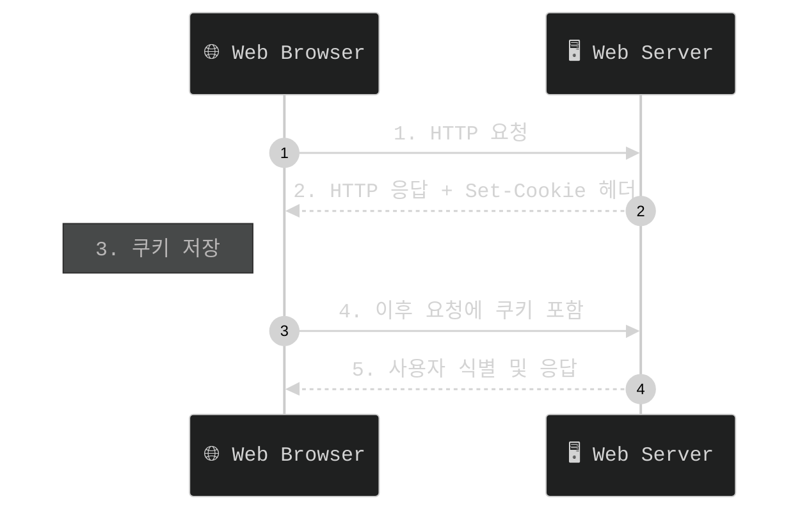
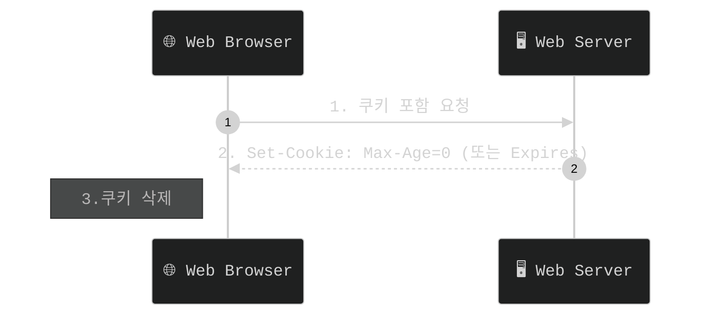
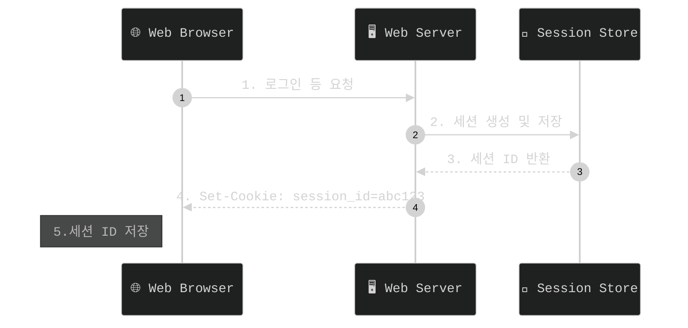

- 초기웹은 단순히 문서를 전달하고 정보를 공부하는 용도로 사용되었기에 **상태유지가 필요 없었습니다.**
- 현대의 웹은 **물품구매**,**사용자 관리**,**결제**등 다양한 기능을 포함하게 되면서 상태정보를 유지해야 할 필요가 생겼습니다. 
- 쿠키는 사용자 인증, 상태유지, 사용자 식별등을 위한 핵심 기술로 웹에서 매우 중요한 역할을 합니다.
- 쿠키를 통해 사용자를 식별하고 세션 유지를 통해 서버와 클라이언트 간의 상태를 관리할수 있습니다.

## 1. 쿠키와 세션

-  쿠키에는 지속쿠키와 세션쿠키가 존재합니다.
-   오늘날 "쿠키"라고 하면 보통 **지속 쿠키(persistent cookie)**를 의미합니다.
- "세션"은 **세션 쿠키(session cookie)**를 의미합니다. 

### 쿠키

- 쿠키는 웹 서버에서 발급시 클라이언트 하드디스크에 텍스트 형태로 저장됩니다.
- 클라이언트 pc사용자들은 해당 쿠키정보를 열람할수 있습니다[ 이는 보안상 취약함 ]

#### 쿠키 발급과정

#### 쿠키 폐기과정

- 쿠키를 폐기 하여도 해당 값을 알고 있으면 재사용이 가능한 문제점이 있습니다. 
- 쿠키값이 평문일 경우 반드시 암호화 과정이 필요합니다. 

### 세션

- 세션은 서버에서 발급시 웹 브라우저 캐시에 저장됩니다.
- 서버측에 해당 세션에 대한 정보를 가지고 있습니다.
    - 메모리,파일시스템,데이터베이스 등 여러 저장 방법이 있습니다. 
- 문자가 암호화 난독화 되어 있는 형태가 아닌 임의의 문자들이 무작위로 나열된 것으로 공격자 측에서는 특정 사용자의 세션 추측이 어렵습니다.
- 세션은 브라우저를 닫거나 일정 시간이 지나면 세션이 자동완료 됩니다.
- 로그인 상태를 유지가 필요한 경우 쿠키와 같이 사용됩니다.

#### 세션 발급과정

## 2. 쿠키와 세션의 발전과정
### 초기쿠키

- 초기 쿠키는 단순히 사용자pc에 물리적으로 저장되는 문제가 있었습니다. 하지만 이는 보안상 취약한 부분이였습니다.

### 세션 도입

- 쿠키를 사용하여 세션 ID를 저장하고 관리하는 방식이 등작하였습니다. 

### JWT 등장

- 세션은 서버에 부담을 줄수 있고 쿠키는 보안상 취약하다는 단점이 각각 있습니다. 
- 그래서 등장한 개념이 JWT입니다. 클라이언트 측에서 상태유지를 하지만 암호화된 토큰방식으로 보안성이 향상되었습니다.

## 3. JWT

- JWT는 웹 애플리케이션에서 사용자 인증,정보교환을 위해 사용되는 인증 토큰입니다. 
- JWT는 두 시스템간 Json형태로 안전하게 정보전송할수 있도록 설계되었습니다.
- 사용자 인증과 권한 부여에 주로 사용됩니다.

### 구성

- Header파트: 토큰의 유형및 알고리즘정보등이 포함됩니다.
- Payload파트: 사용자 장보를 포함합니다.
- Signature 파트: 정보들을 암호화 하여 토큰의 무결성을 보장합니다.

### 특징
- 사용자 정보를 토큰 자체에 포함하여 상태를 유지합니다.
- 클라이언트에서 관리가 됩니다. 그로 인하여 서버의 부담이 줄어듭니다.
- 암호화를 통하여 위조방지를 합니다.
- 토큰이 길어질 경우 네트워크상 트래픽 증가로 인하여 서버에 부담이 될수 있습니다.

## 4. 브라우저 저장소

- 로컬 스토리지, 세션 스토리지, 쿠키가 존재합니다.

### 로컬 스토리지
- 일반적으로 키-값 쌍으로 구조화된 방식으로 데이터 저장합니다.
- 로컬스코리지는 브라우저 내부 데이터 저장할수 있는 영구 저장소 입니다.
- 데이터는 클라이언트 측 컴퓨터에 저장되어 있으며 데이터를 수동으로 지우지 않는이상 영구적 보관이가능합니다.
- 저장된 데이터는 동일한 도메인에서 접근이 가능합니다.

### 세션 스토리지

- 일반적으로 키-값 쌍으로 구조화된 방식으로 데이터를 저장합니다.
- 세션 스토리지는 로컬 스토리지와 매우 유사하지만, 데이터가 브라우저 창이 닫힐 때 자동으로 삭제된다. 세션 스토리지는 사용자가 웹 사이트에 있는 동안에만 필요한 임시 데이터를 저장하는 데 사용합니다.
- 사용자가 웹 사이트를 다시 방문하면 새로운 세션이 시작되며, 이전 세션에서 저장된 데이터는 사용할 수 없습니다.

### 쿠키

- 웹사이트에서 사용자의 브라우저에 저장하는 작은 데이터 조간을 의미합니다.
- 쿠키는 로컬 스토리지나 세션 스토리지에 비해 용량 제한이 작지만, 서버 전송이 가능합니다.
- 쿠키는 다른 도메인에서도 접근이 가능하므로 보안성이 낮습니다.