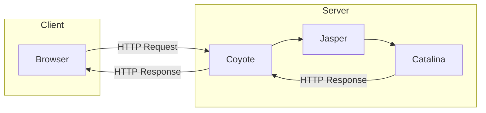

## 1. 아파치 웹 서버의(Apache Web Server) 개념

- Apache Web Server는 오픈소스 기반의 웹 서버입니다.
- HTTP/HTTPS 를 통해 클라이언트의 요청을 처리하고 응답합니다. 
    - 전세계에서 널리 사용되는 Web Server입니다.
    - 다양한 OS에서 실행이 가능합니다.
    - 모듈식 구조로 인하여 확장성이 뛰어납니다.
- 정적 콘텐츠를 제공하며 SSL을 지원합니다.
- Apache Web Server 의 특징중 하나인 모듈식 구조로 인하여 기능 추가,비활성화가 가능합니다.


## 2. 아파치의 기본 구조와 모듈

### 기본구조
- Apache는 MPM(Multi Processing Module,MPM) 구조를 기반으로 클라이언트 요청을 처리합니다.
    - **멀티프로세싱 모듈 (Multi Processing Module,MPM)** 
        - Apache에서 요청을 받아들이고 처리하기 위해 사용되는 모듈입니다.
        - Apache 웹서버는 여러 사용자의 요청을 동시에 처리해야 하기 때문에 멀티 프로세싱이라는 기술이 필요합니다.  이를위해 사용되는 모듈이 MPM입니다.
        - MPM에는 크게 3가지가 있습니다.
    - MPM종류
        - **mpm_prefork** : 
            - 각 Request 를 별도의 프로세스로 처리합니다.
                - 대량의 메모리가 필요합니다.
                - 안정성이 높으며 독립적이여서 다른 요청에 영향을 주지 않습니다.
                - 구조가 간단하며 구현이 쉽다는 특징이 있습니다.
        - **mpm_worker**:
            - mpm_worker는 동시에 여러 스레드를 지원합니다.
            - 이것은 아파치가 좀 더 효율적이고 확장 가능하도록 돕습니다.
                - 메모리를 적게 사용한는 특징이 있습니다.
                - Multi-CPU에서 성능이 좋습니다.
                - 통신량이 많은서버에 적합합니다.
        - **mpm_even**
            - mpm_event는 mpm_worker와 유사한 방식으로 동작하지만 최근 등장한 웹 관련 애플리케이션을 위한 keep alive 메커니즘이 포함되어 있습니다.
            - 이러한 방식은 커넥션마다 새로운 스레드가 필요하다는 관점에서 커넥션이 대규모로 많아질 때 성능 측면에서 많은 이슈가 발생할 수 있습니다.

### 주요모듈
- mod_proxy
    - Apache 서버에서 포워드 프록시, 리버스 프록시, 부하 분산기능을 위해 사용하는 모듈 입니다.
- mod_ssl 
    - SSL/TLS 지원을 위한 모듈로, 안전한 데이터 전송을    가능하게 합니다.
- mod_reweite
    - URL을 재작성하는 데 사용되는 모듈로, SEO에 유리한 URL 구조를 만들 수 있습니다

### 추가적인 모듈
- mod_jk
    - 아파치와 톰캣을 연동하기 위한 모듈입니다. 
- mod_headers
    - HTTP Header를 다루는 모듈입니다.
- mod_cband
    - 접속량 및 트래픽 량을 체크 및 어떤 아이피가 접속하였는지 여부 확인 등을 진행하거나 해당 기록을 통해 사이트에 제한을 주는 용도로 사용되는 모듈입니다.

## 3. 아파치의 주요 설정 파일
- 아파치 설정파일을 설정하고 변경함으로 아파치의 성능 안정성,보안을 구현할수 있습니다.
- 주로 사용되는 httpd.conf외에도 여러개의 용도별 설정파일이 존재합니다.
- `httpd.conf`: 아파치의 메인설정파일입니다. 주요 구성요소(지시자)는 아래와 같습니다.
    - `ServerRoot` 
        - Apache 서버가 존재하는 디렉토리를 설정합니다.
        - 다른 지시자의 상대 경로는 ServerRoot를 기준으로 지정됩니다.
    - `Listen` 
        - Apache와 통신하는 특정한 포트를 설정합니다.
    - `Include`
        - httpd.conf가 아닌 다른 설정 파일(httpd-mpm.conf, httpd-vhost.conf 등)을 포함하여 적용합니다.
    - `ServerAdmin`
        - 서버에서 오류가 발생했을때 클라이언트로 전송하는 오류 메세지에 들어갈 이메일 주소를 설정합니다.
    - `ServerName`
        - 버가 자신을 식별하기 위해서 사용하는 호스트 이름 및 포트를 설정합니다.
        - 등록된 DNS 이름을 가지고 있지 않다면 IP 주소로 설정해야합니다.
        - ServerName을 서버가 확인할 수 없는 IP 주소로 설정하면 Apache 구동 시 경고 메세지를 표시하고, 시스템에서 사용할 수 있는 모든 호스트 이름을 사용합니다.
    - `DocumentRoot`
        - 웹 서버의 루트 디렉터리를 지정합니다.
    - `<Directory>`
        - 해당 디렉토리 경로 또는 와일드카드, 정규 표현식으로 설정된 디렉토리 또는 파일에 적용되는 옵션을 설정합니다.
    - `DirectoryIndex`
        - 클라이언트가 파일이 아닌 디렉토리 경로를 요청했을 경우 제공할 파일 목록을 설정합니다.
    - `ErrorLog`
        - Apache 에러 로그가 생성될 경로를 지정합니다.
    - `LogLevel`
        - ErrorLog의 로그 수준을 설정합니다.
    - `LogFormat`
        - 커스텀 로그에 사용되는 로그 형식을 설정할 수 있습니다.
        - 설정한 로그 포맷에 이름을 설정하여 간단하게 저장하고 사용할 수 있습니다.
- 
- `httpd-autoindex.conf`
    - 디렉토리의 내용을 어떻게 로딩할 것인가에 관한 아파치설정파일 입니다.
- `httpd-dav.conf`
    - WebDAV에 관한 아파치 설정파일 입니다.
- `httpd-default.conf`
    - 아파치웹서버의 기본설정사항들이 설정되어있는 설정파일 입니다.
- `httpd-info.conf`
    -  아파치실행모니터링과 실행상태정보를 설정하는 아파치설정파일 입니다.
- `httpd-languages.conf`
    - 다른 언어들을 어떻게 표현할 것인가에 대한 아파치 설정파일 입니다.
- `httpd-manual.conf`
    - 아파치웹서버의 매뉴얼제공에 대한 설정파일 입니다.
- `httpd-mpm.conf`
    - 아파치웹서버의 MPM specific에 대한 설정파일 입니다.
- `httpd-multilang-errordoc.conf`
    - 콘텐츠협상을 통한 에러문서(Error Document) 설정파일 입니다.
- `httpd-ssl.conf`
    - SSL지원을 위한 아파치 설정파일 입니다.
- `httpd-userdir.conf`
    - 사용자 홈디렉토리에 관한 설정파일 입니다.
- `httpd-vhosts.conf`
    - 아파치 가상호스트에 대한 설정파일 입니다.

## 4. .htaccess 파일의 사용법
- .htaccess 파일은 아파치 웹 서버에서 디렉터리 수준의 설정을 오버라이드 할 수 있도록 지원하는 구성 파일입니다.
- 서버의 디렉토리에 대한 동작을 제어할수 있습니다.
- 리디렉션, 인증 관련 설정 등을 할 수 있습니다.


## 5. 아파치 성능 튜닝의 기초

- 서버의 응답 속도와 처리 효율을 최적화하는것입니다.
- 서버 리소스를 적절히 관리하여 최대 성능을 끌어내는 작업입니다.
### 성능튜닝 목적
- 응답속도 최대화
- 리소스 최적화
- 부하율이 높은상태를 대비

### 주요 튜닝 포인트

- Server Limit
    - 생성가능한 최대 자식프로세스 갯수를 설정합니다.
    - 불필요하게 httpd 프로세스가 생성되지 않도록 제한이 가능합니다.
- MaxClient 
    - 동시 접속가능한 최대 클리언트 갯수를 설정합니다.
- TheradPerChild 
    - child 프로세스가 생성 가능한 스레드 갯수를 설정합니다.
- KeepAlive 
    - 지속적인 요청작업을 계속해서 처리하게 할 것이지 설정합니다.
- MaxKeepAliveRequests
    - Keep-Alive 요청 허용 횟수를 설정합니다.
- Timeout
    - 접속된 클라이언트가 서버에 아무런 요청이 없을때 언제까지 시간을 허용여부를 설정합니다.

## 아파치 vs Nginx

### 아파치 특징

- 스레드 / 프로세스 기반 구조입니다.
- 요청마다 새로운 스레드/프로세스를 생성합니다
    - 사용자가 많아질수록 자원 소모 증가하게 됩니다.

#### 장점
- 다양한 모듈이 제공됩니다.
- 동적컨텐츠 직접 처리 가능합니다.
- 안전성과 호환성 모두 우수합니다.
#### 단점
- 요청마다 프로세스/스레드 생성 됩니다.
    - 자원 낭비로 이어지게 됩니다.
- 다수의 동시 접속 시 성능 저하 됩니다.
- 하나가 지연되면 전체가 지연 됩니다.

### NginX
- 이벤트 기반 처리 구조입니다.
    - 소수의 프로세스만 사용합니다.
        - 비동기방식으로 다수연결처리 합니다.
    - CPU 효율성이 향상됩니다.
- 리버스 프록시 서버로 활용이 가능합니다.

#### 장점
- CPU/메모리 자원 사용률 낮음
- 동시 접속자 수 증가해도 성능 유지
- 빠른 응답 속도, 가볍고 효율적
#### 단점
- 동적 컨텐츠 직접 처리 불가합니다.
    - 외부 프로세서가 필요합니다.
- 아파치에 비하여 모듈수가 적습니다.

| 항목             | Apache                       | NginX                     |
|------------------|------------------------------|---------------------------|
| 구조             | 요청 당 스레드/프로세스      | 비동기 이벤트 기반         |
| 성능             | 동시 요청 많을수록 저하       | 동시 요청 처리 우수        |
| 자원 사용        | CPU/메모리 많이 사용         | 자원 효율적                |
| 모듈             | 다양                         | 상대적으로 적음            |
| 동적 컨텐츠      | 직접 처리 가능               | 외부에 의존                |
| 안정성/확장성/성능    | 안정성, 확장성, 호환성 우세                        | 성능 우세                  |

## Tomcat의 대해 이해하기
- 자바 웹 애플리케이션 서버 입니다.
- 웹 애플리케이션을 실행하기 위한 자바 서블릿 및 JSP(JavaSever Pages)를 지원합니다.

### Tomcat의 구조


- Coyote (HTTP Component) : Tomcat에 TCP를 통한 프로토콜 지원 합니다.
- Catalina (Servlet Container) : 자바 서블릿을 호스팅하는 환경을 의미합니다.
- Jasper (JSP Engine) : 실제 JSP 페이지의 요청을 처리하는 Servlet 입니다.

## 클라우드 환경에서 아파치 설치
- GCP를 사용하였으며 우분투 환경에서 진행됩니다.
- 일단 우분투를 최신상태로 업데이트 한후 apache2를 설치합니다.
```shell
sudo apt update && sudo apt -y install apache2
```
-  그다음으로 현재 실행 상태여부를 파악하겠습니다.
```shell
sudo systemctl status apache2
```
- 실행여부 결과 정상적으로 작동중이였고.. 이제 접속을 해야 했습니다.

- 여기서 먼저 알아봐야 할것은 외부 IP주소를 파악해야 했습니다.
- 물론 GCP에서 외부IP주소를 알려주긴 하였지만 한번더 리눅스 환경에서 확인 해봤습니다.

```shell
curl ifconfig.me
```

- 그리고 `http://<ip>`로 접속을 해보았고 접속에 성공하였습니다.

