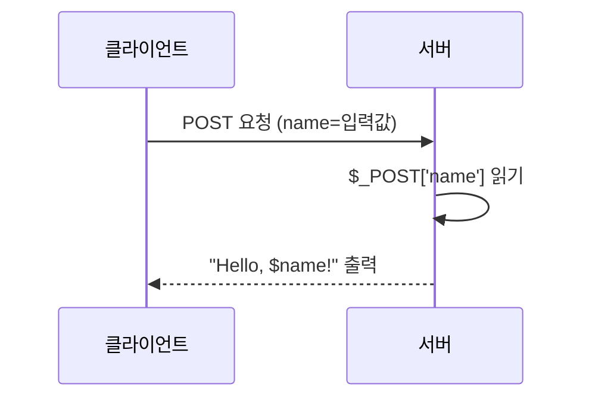
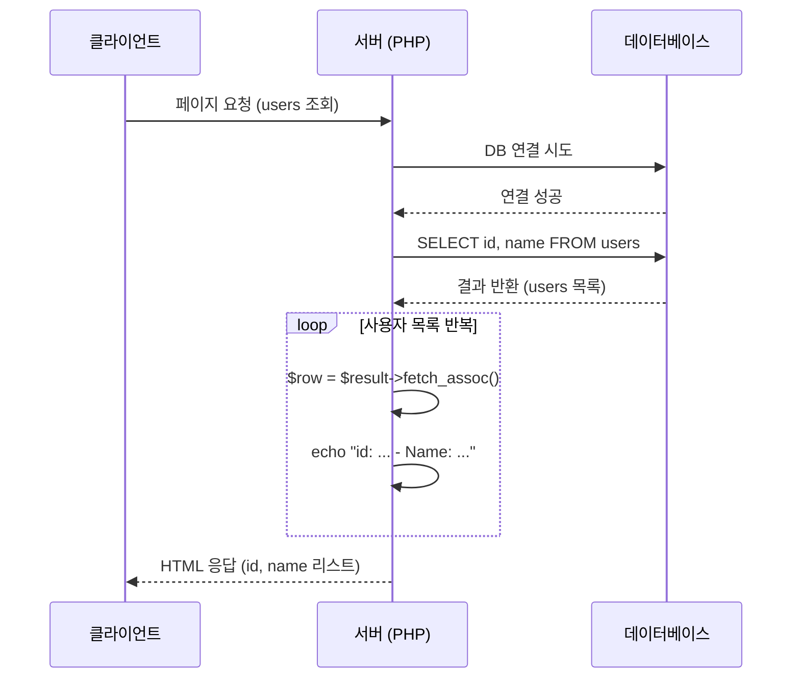

## 1. PHP개념,특징

- PHP(PHP: Hypertext Preprocessor)는 C언어를 기반으로 만들어진 서버 측에서 실행되는 서버 사이드 스크립트 언어입니다.

- PHP는 동적 웹 페이지를 쉽고 빠르게 만들 수 있도록 해주는 데 그 목적이 있습니다.

### 장점과 단점
- 장점
    1. 주요 운영체제와 대부분의 웹 서버에서 지원합니다.
    2. 다른 프로그래밍 언어보다 직관적으로 코드를 작성할 수 있어서, 작성해야 하는 코드의 양이 적습니다.

- 단점
     1. 간단한 사이트를 제작하기 위해 만든 언어라서 복잡한 사이트를 만드는 데는 효율적이지 못합니다.
     2. 보안에 안전하지 않은 언어 구조를 가집니다.
- 특징
    - 서버에서 실행되고 결과만 클라이언틀 전송합니다.
    - HTML내에서 PHP코드를 삽입하는 형태이므로 동적 컨텐츠 생성에 유리합니다.
    - 데이터베이스 연동이 가능하여 동적으로 처리가 가능합니다.
    - 오픈소스 입니다. 이로 인하여 자유롭게 사용할수 있습니다.
    - 대표적으로 워드프레스에서PHP를 많이 사용합니다.

## 2. PHP 기본문법,변수
- php는 `<?php `로 시작하여 `?>`로 끝이납니다. 
### 변수와 상수
1. 변수
    - PHP에서는 변수를 명시할때 달러기호 `$`를 명시해야 합니다. 
    - 변수이름은 대소문자를 구분합니다.

```php

<?php
$var = 'Bob';
$Var = 'Joe';
echo "$var, $Var";     // 대소문자를 구분하며 해당부분은 Bob과 Joe를 출력하는 함수입니다.
$_4site = 'not yet';    
$täyte = 'mansikka';   
?>
```

2. 상수
    - 상수는 define하는 함수를 사용하거나 아니면 const를 명시하여 선언을 할수 있습니다.
    - 변수와 다르게 선언할 경우 `$`를 명시하지 않습니다.
    - 상수는 변수 범위 규칙에 관계없이 어디서나 정의되고 액세스될 수 있습니다.

    ```php
    <?php
    define("CONSTANT", "Hello world.");
    echo CONSTANT; 
    // const사용하여 상수 선언
    const CONSTANT = 'Hello World';
    echo CONSTANT;
    ?>
    ```

### 주석 
- 주석은 코드 로직을 설명할때 사용합니다.
- 코드 자체에 영향을 주지 않습니다.
1. 한줄 주석
    - 한줄을 주석할 경우 `//`를  사용합니다.

    ```php
    // 한줄 주석
    ```

2. 여러줄 주석 
    - `/* */`를 사용하여 여러줄 주석이 가능합니다.

    ```php
    /*
    여러줄 주석 예시 입니다. 이는 여러줄을 한번에 주석처리 할수 있습니다.
    */
    ```

### 연산자
- 종류
    1. 산술연산자
        - 숫자 값을 연산하는데 사용이 됩니다. `+`,`-`,`*`,`/`,`%` 가 대표적입니다.

        ```php
        // 산술 연산자 예시
        $a = 10;
        $b = 5;

        $sum = $a + $b;
        echo "덧셈: " . $sum . "<br>";

        $subtraction = $a - $b;
        echo "뺄셈: " . $subtraction . "<br>";

        $multiplication = $a * $b;
        echo "곱셈: " . $multiplication . "<br>";

        $division = $a / $b;
        echo "나눗셈: " . $division . "<br>";

        $modulus = $a % $b;
        echo "나머지: " . $modulus . "<br>";

        ```

    2. 대입연산자
        - 변수에 닶을 할당하는데 사용됩니다.
        - `=`(대입),`+=`(덧셈후 대입),`-=`(뺄셈후 대입),`*=`(곱셈후 대입),`.=`(나눗셈 후 대입)등이 존재합니다.

        ```php
        // 대입 연산자
        $c = 3;
        $c += 2;
        echo "더하고 대입: " . $c . "<br>";

        $d = 7;
        $d -= 4;
        echo "빼고 대입: " . $d . "<br>";

        ```

    3. 비교연산자
        - 비교 연산자는 값의 비교를 수행하고, 결과로 불리언 값을 반환합니다.
        - == (같음), != (같지 않음), > (크다), < (작다), >= (크거나 같다), <= (작거나 같다) 등이 있습니다.

        ```php
        $e = 5;
        $f = 3;

        $equalTo = ($e == $f);
        echo "같음: " . var_export($equalTo, true) . "<br>";

        $notEqual = ($e != $f);
        echo "같지 않음: " . var_export($notEqual, true) . "<br>";

        $greaterThan = ($e > $f);
        echo "크다: " . var_export($greaterThan, true) . "<br>";

        $lessThan = ($e < $f);
        echo "작다: " . var_export($lessThan, true) . "<br>";

        ```

    4. 논리 연산자
        - 논리 연산자는 True or False 값의 조합을 수행하고, 결과로 불리언 값을 반환합니다. 
        - && (논리 AND), || (논리 OR), ! (논리 NOT) 등이 있습니다.

        ```php
        $g = true;
        $h = false;

        $andResult = ($g && $h);
        echo "논리 AND: " . var_export($andResult, true) . "<br>";

        $orResult = ($g || $h);
        echo "논리 OR: " . var_export($orResult, true) . "<br>";

        $notResult = !$g;
        echo "논리 NOT: " . var_export($notResult, true) . "<br>";

        
        ```
    5. 문자열 연산자
        -  문자열 연산자는 문자열을 연결하거나 조작하는 데 사용됩니다.
        - `.` (연결) 연산자가 주로 사용되며, 두 개의 문자열을 연결하여 새로운 문자열을 생성합니다

        ```php
        // 문자열 연산자
        $name = "John";
        $greeting = "Hello, " . $name . "!";
        echo $greeting . "<br>";

        ```

    6. 증감연산자
        - 증감 연산자는 변수의 값을 증가시키거나 감소시킵니다. ++ (증가), -- (감소) 연산자가 존재합니다.
        - 변수의 값을 1씩 증가시키거나 감소시킵니다.

        ```php
        
        // 증감 연산자
        $i = 10;
        $i++;
        echo "증가: " . $i . "<br>";

        $j = 5;
        $j--;
        echo "감소: " . $j . "<br>";
        ```
    7. 조건부 연산자
        - 조건에 따라 다른 값을 반환하는 데 사용됩니다. 
        - `조건 ? 참일 때 값 : 거짓일 때 값` 의 형식을 가지며, 조건이 참일 때와 거짓일 때 각각 다른 값을 반환합니다.

        ```php
        <?php
        // 조건부 연산자
        $score = 85;
        $result = ($score >= 80) ? "합격" : "불합격";
        echo "시험 결과: " . $result . "<br>";
        ?>
        ```
### 조건문 , 반복문
1. 조건문
    - 조건문은 주어진 조건에 따라 프로그램의 흐름을 제어합니다.
    - if, else, else-if문 이렇게 3가지를 이용하여 흐름을 제어합니다.
    - `if`: if문은 주어진 조건이 참인 경우에 코드 블록을 실행합니다.

    ```php
    <?php
    $score = 85;
    if ($score >= 80) { // 값이 80이상이면 실행하는 코드
    echo "합격입니다!";
    }   
    ?>
    ```

    - `if-else`: if-else문은 주어진 조건이 참인 경우와 거짓인 경우에 각각 다른 코드 블록을 실행합니다.

    ```php
    <?php
    $score = 70;
    if ($score >= 80) {
    echo "합격입니다!";
    } else {
    echo "불합격입니다!";
    }
    ?>

    ```

    - `if-elseif-else`:if-elseif-else문은 여러 개의 조건을 순차적으로 검사하며, 해당하는 조건에 따라 다른 코드 블록을 실행합니다.

    ```php
    <?php
    $score = 60;
    if ($score >= 80) {
        echo "우수합니다!";
    } elseif ($score >= 60) {
        echo "보통입니다.";
    } else {
        echo "미흡합니다.";
    }

    
    ?>
    ```

2. 반복문
    - 반복문은 주어진 조건이 참일때 까지 특정 코드블록을 반복적으로 실행합니다.
    - `for`: 초기화, 조건, 반복 실행 후의 작업 순서로 반복 실행합니다.

        ```php
        for ($i = 1; $i <= 5; $i++) {
            echo $i . "<br>";
        }

        ```
    
    
    - `foreach`: 배열의 각 원소에 대해 코드 블록을 반복 실행합니다.
        ```php
        $fruits = array("apple", "banana", "orange");
        foreach ($fruits as $fruit) {
        echo $fruit . "<br>";
        }

        
        ```

    - `while`: 주어진 조건이 참인 동안 코드 블록을 반복 실행합니다.

        ```php
        $i = 1;
        while ($i <= 5) {
            echo $i . "<br>";
            $i++;
        }

        
        ```
    - `do-while`: 코드 블록을 먼저 실행한 후 주어진 조건이 참인 동안 반복 실행합니다.

    ```php
    $i = 1;
    do {
        echo $i . "<br>";
        $i++;
    } while ($i <= 5);

    
    ```


### 배열과 문자열
1. 배열 
    - 배열은 여러 개의 값을 하나의 변수에 저장하는 데 사용됩니다.
    배열을 선언하려면 array() 함수를 사용하거나 대괄호([])를 사용할 수 있습니다.
    - 배열의 값에 접근하려면 인덱스를 사용합니다. 인덱스는 0부터 시작하며, 대괄호([]) 안에 인덱스를 넣어 사용합니다.
    - 배열에 값을 추가하려면 [] 안에 인덱스를 지정하고 값을 할당합니다.
    - foreach 문을 사용하여 배열의 모든 값에 접근할 수 있습니다.

    ```php
    // 배열 생성
    $fruits = array("apple", "banana", "orange");
    $numbers = [1, 2, 3, 4, 5];
    // 배열 출력
    echo $fruits[0]; // "apple" 출력
    echo $numbers[2]; // 3 출력
    // 값 추가
    $fruits[3] = "grape"; // 인덱스 3에 "grape" 저장
    // 반복
    foreach ($fruits as $fruit) {
   echo $fruit . "<br>";
    }

    ```

2. 문자열
    - 문자열은 문자들의 시퀀스로 구성된 데이터입니다.
    - 작은따옴표('')나 큰따옴표("")로 문자열을 감싸서 선언할 수 있습니다.
    - `<<< EOF` 문법은 여러 줄에 걸쳐 문자열을 작성할 때 유용합니다.
    - 문자열을 결합하려면 점(.) 연산자를 사용합니다.
    - strlen() 함수를 사용하여 문자열의 길이를 알 수 있습니다.
    - substr() 함수를 사용하여 문자열의 일부분을 추출할 수 있습니다.
    - strpos() 함수를 사용하여 특정 문자열이 위치한 인덱스를 찾을 수 있습니다.

    ```php
    //선언
    $name = 'John';
    $message = "Hello, $name!";
    // 문자열 결함
    $greeting = "Hello" . "World"; 
    $text1 = "Hello";
    echo strlen($text1); // 문자열길이
    $text2 = "Hello, World!";
    echo substr($text2, 7, 5); // 문자열 추출
    $text3 = "Hello, World!";
    echo strpos($text3, "World"); // 문자열 검색


    //EOF 문법
    $text = <<< EOF
        이것은
        여러 줄에 걸친
        문자열입니다.
    EOF;
    ```

## 3. 함수의 정의와 사용
1. 함수
    - 함수는 코드 재사용, 모듈화를 위하여 사용합니다.
    - 특정작업을 수행하는 코드 블록을 호출하여 사용할수 있도록 해줍니다.
    - `function`키워드를 이용하여 함수를 선언합니다.
    - 함수에 매개변수를 전달하여 함수내에서 사용할수 있습니다.
    - 함수는 값을 반환할수 있습니다.

    ```php
    <?php
    function sayhello() {
    echo "Hello, World!";
    }

    sayhello();
    ?>
        
    ```
    - sayhello()함수를 사용하여 Hello, World라는 문자열을 출력합니다.

    ```php
    <?php
    function add($a1, $a2) {
        return $a1 + $a2;
    }

    $result = add(5, 10);
    echo "The result is $result";
    ?>

    
    ```
    - 위 코드는  add함수를 선언하고 사용을 하는 예제 입니다.
    - add함수에 5와 10을 파라미터(매개변수)로 전달하여 연산 후 반환합니다.
    
    
2. [추가개념] 클래스
    - 클래스는 객체지향 프로그래밍의 기본단위로 속성과 메서드로 구성됩니다.
    - class키워드를 사용하여 클래스를 선언합니다.
    - new를 사용하여 인스턴스를 생성합니다.
    - 객체 속성에 접근 또는 메서드 호출을 하기 위해서는 화살표 연산자를 이용해야 합니다.
    
    - **클래스 예제**
        
        ```php
        <?php
        class Car {
        public $name;
        public $color;
        public function __construct($name, $color = "white") {
        $this->name = $name;
        $this->color = $color;
        }

        public function start() {
             echo $this->name . " (color: " . $this->color . ") starting.";
        }
        }

        $myCar = new Car("Hello");

        ?>

        
        ```
## 4. form 데이터 처리
- form은 html에서 사용되는 태그 입니다.
- 사용자가 입력한 데이터를 서버로 전송하는 역할을 하며 어디로 어떤방식으로 전달할것인지 명시해야 합니다.

```html
<form method="post" action="process.php">
    Name: <input type="text" name="name" />
    <input type="submit" />
</form>


```

- 위 코드를 분석해보면 method는 전송방식을 명시합니다. 대표적으로 get과 post방식이 있으며 위의 코드에서는 post전송방식을 사용하였습니다.
    - **get 과 post 차이점**
        - get 방식의 경우 url의 파라미터에 데이터를 포함시키는 방식입니다. 
        - 데이터가 적은 경우 또는 보안에 있어서 민감한 데이터가 아닌경우에 사용됩니다.
        - post방식은 데이터를 HTTP Message body부분에 포함하여 전송을 합니다.
        - 이는 데이터가 민감한 정보이거나 아니면 데이터가 많은 경우 사용합니다.
- action은 어디로 전송할 것인지를 명시하는 부분입니다. 현재 코드상으로는 procrss.php로 전송을 합니다.
- input 태그에 존재하는 name이라는 부분은 서버에서 데이터를 참조할떄 사용할수 있게 이름을 지정한 것입니다.
- `<input type="submit" />` 이것을 누르면 서버로 데이터가 전송되게 됩니다.

```php
<?php
$name = $_POST['name'];
echo "Hello, $name!";
?>


```

- 위의 코드와 같이 서버에서는 도착한 데이터를 처리하게 됩니다. 위의 코드를 분석하여 보면   `$name = $_POST['name'];`이 부분은 클라이언트로 부터 가져온 값을 name라는 변수에 저장합니다. 
- 쉬운 설명을 위하여 클라이언트로 부터 Secovate라는 값이 클라이언트로부터 입력이 있엇다고 가정하겠습니다.
- 그리고 `echo "Hello, $name!";` 이 부분이 실행되며 `Hello, Secovate!'라는 문자열이 출력 됩니다.

- 아래는 쉽게 그림으로 나타낸 것입니다.




## 5. PHP DB연동 

```php
<?php
$conn = new mysqli("localhost", "username", "password", "database");

if ($conn->connect_error) {
    die("Connection failed: " . $conn->connect_error);
}

$sql = "SELECT id, name FROM users";
$result = $conn->query($sql);

if ($result->num_rows > 0) {
    while($row = $result->fetch_assoc()) {
        echo "id: " . $row["id"]. " - Name: " . $row["name"]. "<br />";
    }
} else {
    echo "0 results";
}
$conn->close();
?>


```
### 코드 분석
1. 데이터베이스 연결 

```php
$conn = new mysqli("localhost", "username", "password", "database");

```

- 해당 코드는 DB에 연결하여 데이터를 조회후 출력하는 코드 입니다.
- ` new mysqli();` 해당 부분은 sql이랑연결을 시도하는 인스턴스를 생성합니다.
- 우선 첫번째 파라미터로 데이터베이스 서버 주소를 지정합니다.
- 두번째 파라미터는 사용자이름을 명시합니다.
- 세번째 파라미터는 비밀번호를 명시합니다.
- 네번째 파라미터는 DB이름을 명시합니다.

```php
if ($conn->connect_error) {
    die("Connection failed: " . $conn->connect_error);
}
```

- 이 부분은 연결실패시 출력을 합니다.
- die() 함수는 오류 발생시 종료하는 함수입니다.

2. 조회/출력

```php
$sql = "SELECT id, name FROM users";
$result = $conn->query($sql);

if ($result->num_rows > 0) {
    while($row = $result->fetch_assoc()) {
        echo "id: " . $row["id"]. " - Name: " . $row["name"]. "<br />";
    }
} else {
    echo "0 results";
}

```
- user라는 테이블에 id와 이름을 조회 합니다.
- 결과값이 0보다 클경우에는  반복문을 이용하여 출력을 하고 그외의 경우는 `0 results`를 출력합니다.
- `$result->num_rows`는 반환된 행의 개수를 확인하기 위해 사용합니다.
- `row = $result->fetch_assoc()` 이 부분은 반환된 결과를 배열의 형태로 가져오는 로직입니다.
- `"id: " . $row["id"]. " - Name: " . $row["name"]. "<br />";` 해당 양식에 맞게 출력을 합니다.

3. db연결 종료

```php
$conn->close();

```

- 연결을 종료합니다
- 전체적인 흐름을 다이어그램으로 표기하면 아래와 같습니다.



### 파일 업로드
- 파일 업로드는 클라이언트가 서버로 파일을 전송하는 과정을 말합니다.
- PHP에서 파일 업로드를 처리하기 위해서는 다음과 같은 단계를 거칩니다.
    - `<form>` 태그의 enctype 속성을 "multipart/form-data"로 설정합니다.
    - `<input type="file">`을 사용하여 파일 선택 필드를 생성합니다.
    - PHP에서 $_FILES 변수를 사용하여 업로드된 파일의 정보를 얻을 수 있습니다.
    - move_uploaded_file() 함수를 사용하여 임시로 저장된 파일을 원하는 위치로 이동시킵니다.

- 업로드 예시

```html

<!DOCTYPE html>
<html>
<head>
    <title>파일 업로드 폼</title>
</head>
<body>
    <h2>파일 업로드</h2>
    <form method="POST" action="upload.php" enctype="multipart/form-data">
        <input type="file" name="file"><br><br>
        <input type="submit" value="업로드">
    </form>
</body>
</html>


```

```php
<?php
if ($_SERVER["REQUEST_METHOD"] == "POST") {
    $file = $_FILES["file"];

    // 파일 유효성 검사
    if ($file["error"] === UPLOAD_ERR_OK) {
        $filename = $file["name"];
        $filetmp = $file["tmp_name"];
        $destination = "uploads/" . $filename;

        // 파일 이동
        if (move_uploaded_file($filetmp, $destination)) {
            echo "파일 업로드 성공!";
        } else {
            echo "파일 업로드 실패.";
        }
    } else {
        echo "파일 업로드 오류: " . $file["error"];
    }
}
?>

```
