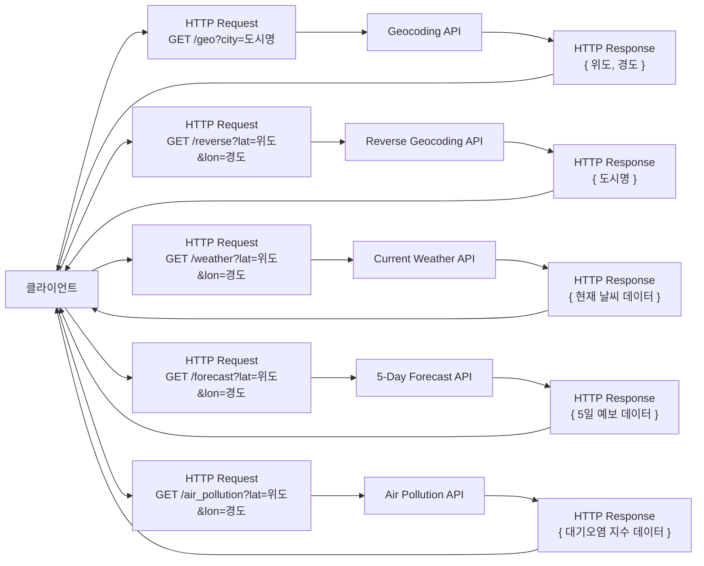

# Weather Forecast Web Application
[GitHub - secovate200/weatherweb](https://github.com/secovate200/weatherweb)

> 실시간 날씨 정보, 5일 예보, 대기질 지수(AQI), 일출·일몰 시각 등을 시각적으로 제공하는 웹 애플리케이션입니다.  
> **OpenWeatherMap API**를 활용하여 기상 데이터를 가져오며, HTML/CSS/JavaScript로 구현되었습니다.

---

## 주요 기능

- 🌍 도시 입력 또는 현위치 기반 날씨 조회
- 🧭 현재 날씨 및 온도, 위치 정보 표시
- ☀️ 일출 및 일몰 시각 표시
- 🌬️ 습도, 체감온도, 기압, 풍속 정보
- 📊 대기오염 지수 (PM2.5, PM10, NO2 등)
- 📆 5일간 일별 예보
- 🕘 시간별 날씨 (8시간 기준)

---

## 🛠️ 사용 기술 스택

| 구분        | 기술                                   |
|-------------|--------------------------------------|
| **Frontend**| HTML5, CSS3, JavaScript              |
| **API**     | [OpenWeatherMap API](https://openweathermap.org/api) |
| **위치 정보**| Geolocation API                      |
| **아이콘**   | Boxicons                            |

---

## 웹 사이트 구조

---

##  주요 학습 포인트

- OpenWeatherMap API 사용 및 JSON 데이터 파싱
- `fetch` API를 통한 비동기 통신 처리
- 날짜/시간 포맷 처리 및 동적 DOM 조작
- 사용자 경험 중심의 시각적 구성

---
